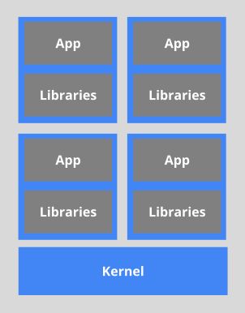

⚠️ __Notice: With respect to licence ([https://creativecommons.org/licenses/by-nc-nd/4.0/](https://creativecommons.org/licenses/by-nc-nd/4.0/)) on this course, I am distributing and sharing important points and some information which  are taken from [https://www.edx.org/course/introduction-to-kubernetes](https://www.edx.org/course/introduction-to-kubernetes) course__

- [Container Orchestration](#container-orchestration)
  - [What Are Containers?](#what-are-containers)
  - [What Is Container Orchestration?](#what-is-container-orchestration)
  - [Container Orchestrators](#container-orchestrators)
  - [Why Use Container Orchestrators?](#why-use-container-orchestrators)
  - [Where to Deploy Container Orchestrators?](#where-to-deploy-container-orchestrators)

# Container Orchestration

With container images, we confine the application code, its runtime, and all of its dependencies in a pre-defined format. And, with container runtimes like __runC__, __containerd__, or __rkt__ we can use those pre-packaged images, to create one or more containers. All of these runtimes are good at running containers on a single host. But, in practice, we would like to have a fault-tolerant and scalable solution, which can be achieved by creating a single controller/management unit, after connecting multiple nodes together. This __controller/management unit__ is generally referred to as a __container orchestrator__. 

In this chapter, we will explore why we should use container orchestrators, different implementations of container orchestrators, and where to deploy them.

## What Are Containers?

__Containers__ are application-centric methods to deliver high-performing, scalable applications on any infrastructure of your choice. Containers are best suited to deliver microservices by providing portable, isolated virtual environments for applications to run without interference from other running applications.

__Microservices__ are lightweight applications written in various modern programming languages, with specific dependencies, libraries and environmental requirements. To ensure that an application has everything it needs to run successfully it is packaged together with its dependencies.

A __container image__ bundles the application along with its runtime and dependencies, and a container is deployed from the container image offering an isolated executable environment for the application. Containers can be deployed from a specific image on many platforms, such as workstations, Virtual Machines, public cloud, etc.

## What Is Container Orchestration?

In Development (Dev) environments, running containers on a single host for development and testing of applications may be an option. However, when migrating to Quality Assurance (QA) and Production (Prod) environments, that is no longer a viable option because the applications and services need to meet specific requirements:

- Fault-tolerance
- On-demand scalability
- Optimal resource usage
- Auto-discovery to automatically discover and communicate with each other
- Accessibility from the outside world
- Seamless updates/rollbacks without any downtime.

__Container orchestrators__ are tools which group systems together to form clusters where containers' deployment and management is automated at scale while meeting the requirements mentioned above.

## Container Orchestrators

With enterprises containerizing their applications and moving them to the cloud, there is a growing demand for container orchestration solutions.

Although not exhaustive, the list below provides a few different container orchestration tools and services available today:

- __Amazon Elastic Container Service__
    [Amazon Elastic Container Service](https://aws.amazon.com/ecs/) (ECS) is a hosted service provided by Amazon Web Services (AWS) to run Docker containers at scale on its infrastructure.

- __Azure Container Instances__
    [Azure Container Instance](https://azure.microsoft.com/en-us/services/container-instances/) (ACI) is a basic container orchestration service provided by [Microsoft Azure](https://azure.microsoft.com/en-us/).

- __Azure Service Fabric__
    [Azure Service Fabric](https://azure.microsoft.com/en-us/services/service-fabric/) is an open source container orchestrator provided by [Microsoft Azure](https://azure.microsoft.com/en-us/).

- __Kubernetes__
    [Kubernetes](https://kubernetes.io/) is an open source orchestration tool, started by Google, part of the [Cloud Native Computing Foundation](https://www.cncf.io/) (CNCF) project.

- __Marathon__
   [Marathon](https://mesosphere.github.io/marathon/) is a framework to run containers at scale on [Apache Mesos](https://mesos.apache.org/).

- __Nomad__
    [Nomad](https://www.nomadproject.io/) is the container orchestrator provided by [HashiCorp](https://www.hashicorp.com/).

- __Docker Swarm__
    [Docker Swarm](https://docs.docker.com/engine/swarm/) is a container orchestrator provided by Docker, Inc. It is part of [Docker Engine](https://docs.docker.com/engine/).

## Why Use Container Orchestrators?

Although we can manually maintain a couple of containers or write scripts for dozens of containers, orchestrators make things much easier for operators especially when it comes to managing hundreds and thousands of containers running on a global infrastructure.

Most container orchestrators can:
- Group hosts together while creating a cluster
- Schedule containers to run on hosts in the cluster based on resources availability
- Enable containers in a cluster to communicate with each other regardless of the host they are deployed to in the cluster
- Bind containers and storage resources
- Group sets of similar containers and bind them to load-balancing constructs to simplify access to containerized applications by creating a level of abstraction between the containers and the user
- Manage and optimize resource usage
- Allow for implementation of policies to secure access to applications running inside containers.

## Where to Deploy Container Orchestrators?

Most container orchestrators can be deployed on the infrastructure of our choice - on bare metal, Virtual Machines, on-premise, or the public cloud. Kubernetes, for example, can be deployed on a workstation, with or without a local hypervisor such as Oracle VirtualBox, inside a company's data center, in the cloud on AWS Elastic Compute Cloud (EC2) instances, Google Compute Engine (GCE) VMs, DigitalOcean Droplets, OpenStack, etc.

There are turnkey solutions which allow Kubernetes clusters to be installed, with only a few commands, on top of cloud Infrastructures-as-a-Service, such as GCE, AWS EC2, Docker Enterprise, IBM Cloud, Rancher, VMware, Pivotal, and multi-cloud solutions through IBM Cloud Private and StackPointCloud.

Last but not least, there is the managed container orchestration as-a-Service, more specifically the managed Kubernetes as-a-Service solution, offered and hosted by the major cloud providers, such as [Google Kubernetes Engine](https://cloud.google.com/kubernetes-engine/) (GKE), [Amazon Elastic Container Service for Kubernetes](https://aws.amazon.com/eks/) (Amazon EKS), [Azure Kubernetes Service](https://azure.microsoft.com/en-us/services/kubernetes-service/) (AKS), [IBM Cloud Kubernetes Service](https://www.ibm.com/cloud/container-service), [DigitalOcean Kubernetes](https://www.digitalocean.com/products/kubernetes/), [Oracle Container Engine for Kubernetes](https://cloud.oracle.com/containers/kubernetes-engine), etc. 