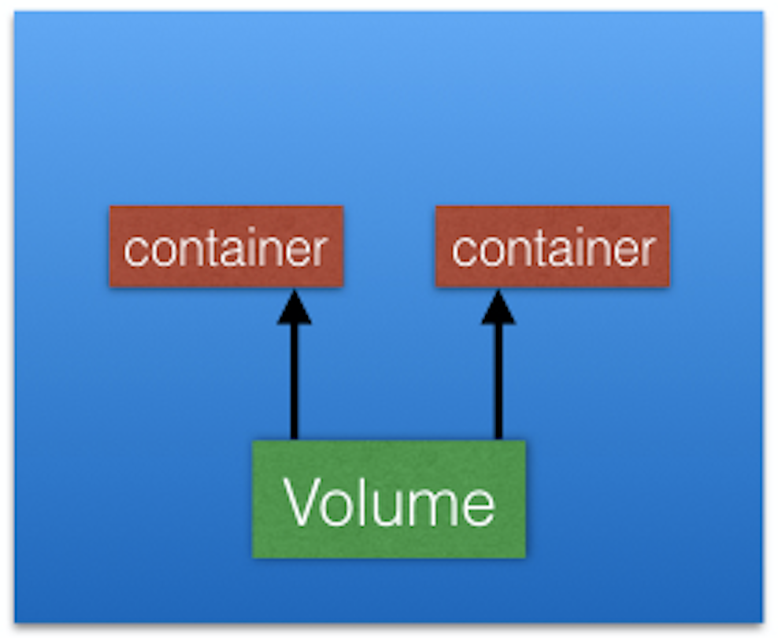
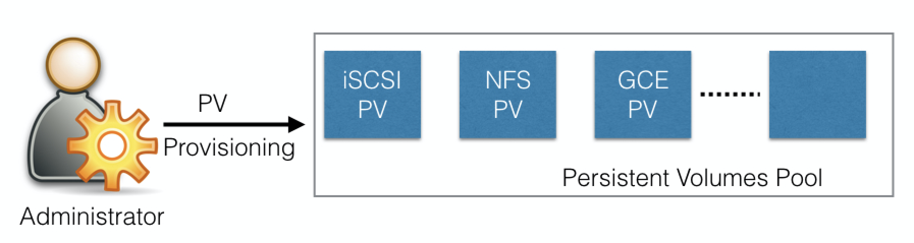
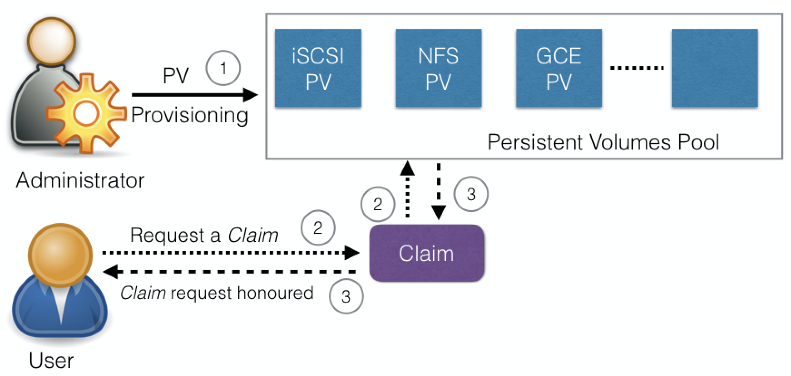

⚠️ __Notice: With respect to licence ([https://creativecommons.org/licenses/by-nc-nd/4.0/](https://creativecommons.org/licenses/by-nc-nd/4.0/)) on this course, I am distributing and sharing important points and some information which  are taken from [https://www.edx.org/course/introduction-to-kubernetes](https://www.edx.org/course/introduction-to-kubernetes) course__

- [Introduction](#introduction)
- [Volumes](#volumes)
- [Volume Types](#volume-types)
- [PersistentVolumes](#persistentvolumes)
  - [PersistentVolumeClaims](#persistentvolumeclaims)
- [Container Storage Interface (CSI)](#container-storage-interface-csi)
- [Using a Shared hostPath Volume Type](#using-a-shared-hostpath-volume-type)

# Introduction 

In today's business model, data is the most precious asset for many startups and enterprises. In a Kubernetes cluster, containers in Pods can be either data producers or data consumers. While some container data is expected to be transient and is not expected to outlive a Pod, other forms of data must outlive the Pod in order to be aggregated and possibly loaded into analytics engines. Kubernetes must provide storage resources in order to provide data to be consumed by containers or to store data produced by containers. Kubernetes uses **Volumes** of several types and a few other forms of storage resources for container data management. In this chapter, we will talk about **PersistentVolume** and **PersistentVolumeClaim** objects, which help us attach persistent storage Volumes to Pods. 

# Volumes

As we know, containers running in Pods are ephemeral in nature. All data stored inside a container is deleted if the container crashes. However, the `kubelet` will restart it with a clean state, which means that it will not have any of the old data.

To overcome this problem, Kubernetes uses [Volumes](https://kubernetes.io/docs/concepts/storage/volumes/). A Volume is essentially a directory backed by a storage medium. The storage medium, content and access mode are determined by the Volume Type.

In Kubernetes, a Volume is attached to a Pod and can be shared among the containers of that Pod. The Volume has the same life span as the Pod, and it outlives the containers of the Pod - this allows data to be preserved across container restarts.

# Volume Types

A directory which is mounted inside a Pod is backed by the underlying Volume Type. A Volume Type decides the properties of the directory, like size, content, default access modes, etc. Some examples of Volume Types are:

- **emptyDir**
  
  An `empty` Volume is created for the Pod as soon as it is scheduled on the worker node. The Volume's life is tightly coupled with the Pod. If the Pod is terminated, the content of `emptyDir` is deleted forever.  
- **hostPath**
  
  With the `hostPath` Volume Type, we can share a directory from the host to the Pod. If the Pod is terminated, the content of the Volume is still available on the host.
- **gcePersistentDisk**
  
  With the **gcePersistentDisk** Volume Type, we can mount a [Google Compute Engine (GCE) persistent disk](https://cloud.google.com/compute/docs/disks/) into a Pod.
- **awsElasticBlockStore**
  
  With the **awsElasticBlockStore**  Volume Type, we can mount an [AWS EBS Volume](https://aws.amazon.com/ebs/) into a Pod. 
- **azureDisk**

  With azureDisk we can mount a [Microsoft Azure Data Disk](https://docs.microsoft.com/en-us/azure/virtual-machines/linux/managed-disks-overview) into a Pod.
- **azureFile**
  
  With **azureFile** we can mount a [Microsoft Azure File Volume](https://github.com/kubernetes/examples/blob/master/staging/volumes/azure_file/README.md) into a Pod.
- **cephfs**
  
  With **cephfs**, an existing CephFS volume can be mounted into a Pod. When a Pod terminates, the volume is unmounted and the contents of the volume are preserved.
- **nfs**

  With [nfs](https://en.wikipedia.org/wiki/Network_File_System), we can mount an NFS share into a Pod.
- **iscsi**

  With [iscsi](https://en.wikipedia.org/wiki/ISCSI), we can mount an iSCSI share into a Pod.
- **secret**
  
  With the **secret** Volume Type, we can pass sensitive information, such as passwords, to Pods. We will take a look at an example in a later chapter.
- **configMap**
  
  With **configMap** objects, we can provide configuration data, or shell commands and arguments into a Pod.
- **persistentVolumeClaim**
  
  We can attach a [PersistentVolume](https://kubernetes.io/docs/concepts/storage/persistent-volumes/) to a Pod using a **persistentVolumeClaim**. We will cover this in our next section. 

You can learn more details about Volume Types in the [Kubernetes documentation](https://kubernetes.io/docs/concepts/storage/volumes/).

# PersistentVolumes

In a typical IT environment, storage is managed by the storage/system administrators. The end user will just receive instructions to use the storage but is not involved with the underlying storage management.

In the containerized world, we would like to follow similar rules, but it becomes challenging, given the many Volume Types we have seen earlier. Kubernetes resolves this problem with the **PersistentVolume (PV)** subsystem, which provides APIs for users and administrators to manage and consume persistent storage. To manage the Volume, it uses the PersistentVolume API resource type, and to consume it, it uses the PersistentVolumeClaim API resource type.

PersistentVolumes can be dynamically provisioned based on the StorageClass resource. A StorageClass contains pre-defined provisioners and parameters to create a PersistentVolume. Using PersistentVolumeClaims, a user sends the request for dynamic PV creation, which gets wired to the StorageClass resource.

Some of the Volume Types that support managing storage using PersistentVolumes are:

- GCEPersistentDisk
- AWSElasticBlockStore
- AzureFile
- AzureDisk
- CephFS
- NFS
- iSCSI

For a complete list, as well as more details, you can check out the [Kubernetes documentation](https://kubernetes.io/docs/concepts/storage/persistent-volumes/#persistent-volumes).

## PersistentVolumeClaims

A __PersistentVolumeClaim (PVC)__ is a request for storage by a user. Users request for PersistentVolume resources based on type, access mode, and size. There are three access modes: ReadWriteOnce (read-write by a single node), ReadOnlyMany (read-only by many nodes), and ReadWriteMany (read-write by many nodes). Once a suitable PersistentVolume is found, it is bound to a PersistentVolumeClaim.

 After a successful bound, the PersistentVolumeClaim resource can be used in a Pod.

 

Once a user finishes its work, the attached PersistentVolumes can be released. The underlying PersistentVolumes can then be reclaimed (for an admin to verify and/or aggregate data), deleted (both data and volume are deleted), or recycled for future usage (only data is deleted). 

To learn more, you can check out the [Kubernetes documentation](https://kubernetes.io/docs/concepts/storage/persistent-volumes/#persistentvolumeclaims).

# Container Storage Interface (CSI)

Container orchestrators like Kubernetes, Mesos, Docker or Cloud Foundry used to have their own methods of managing external storage using Volumes. For storage vendors, it was challenging to manage different Volume plugins for different orchestrators. Storage vendors and community members from different orchestrators started working together to standardize the Volume interface; a volume plugin built using a standardized CSI designed to work on different container orchestrators. You can find [CSI specifications](https://github.com/container-storage-interface/spec/blob/master/spec.md) here.

Between Kubernetes releases v1.9 and v1.13 CSI matured from alpha to [stable support](https://kubernetes.io/blog/2019/01/15/container-storage-interface-ga/), which makes installing new CSI-compliant Volume plugins very easy. With CSI, third-party storage providers can [develop solutions](https://kubernetes-csi.github.io/docs/) without the need to add them into the core Kubernetes codebase. 

# Using a Shared hostPath Volume Type

<iframe width="736" height="450" src="https://www.youtube.com/embed/27vj5E_Zqqo" frameborder="0" allow="accelerometer; autoplay; encrypted-media; gyroscope; picture-in-picture" allowfullscreen></iframe>