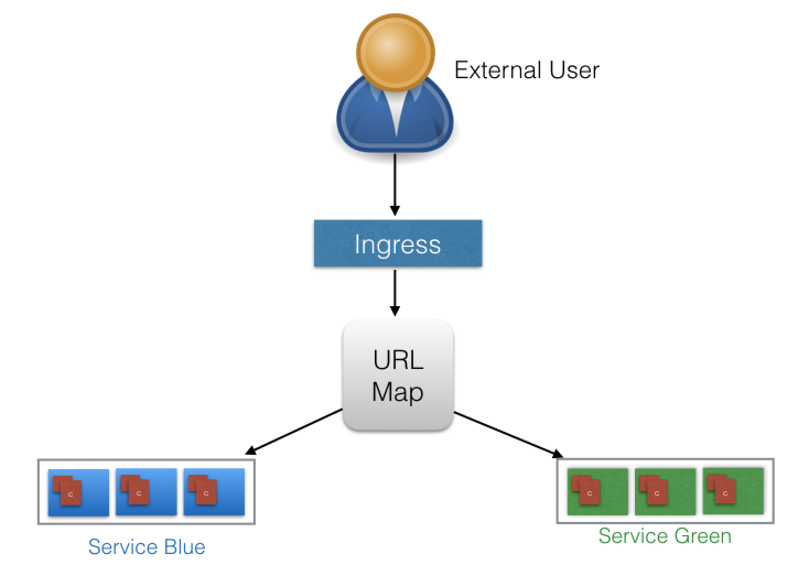
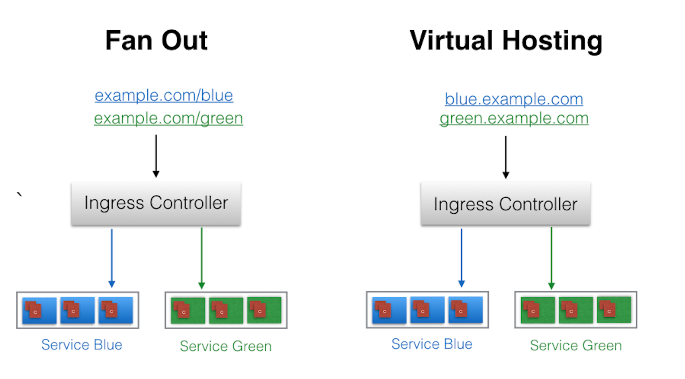

⚠️ __Notice: With respect to licence ([https://creativecommons.org/licenses/by-nc-nd/4.0/](https://creativecommons.org/licenses/by-nc-nd/4.0/)) on this course, I am distributing and sharing important points and some information which  are taken from [https://www.edx.org/course/introduction-to-kubernetes](https://www.edx.org/course/introduction-to-kubernetes) course__


- [Introduction](#introduction)
- [Ingres](#ingres)
- [Ingress Controller](#ingress-controller)
  - [Deploy an Ingress Resource](#deploy-an-ingress-resource)
  - [Access Services Using Ingress](#access-services-using-ingress)


# Introduction

In an earlier chapter, we saw how we can access our deployed containerized application from the external world via Services. Among the ServiceTypes the NodePort and LoadBalancer are the most often used. For the LoadBalancer ServiceType, we need to have support from the underlying infrastructure. Even after having the support, we may not want to use it for every Service, as LoadBalancer resources are limited and they can increase costs significantly. Managing the NodePort ServiceType can also be tricky at times, as we need to keep updating our proxy settings and keep track of the assigned ports. In this chapter, we will explore the Ingress API resource, which represents another layer of abstraction, deployed in front of the Service API resources, offering a unified method of managing access to our applications from the external world.


# Ingres 

With Services, routing rules are associated with a given Service. They exist for as long as the Service exists, and there are many rules because there are many Services in the cluster. If we can somehow decouple the routing rules from the application and centralize the rules management, we can then update our application without worrying about its external access. This can be done using the Ingress resource. 

According to [kubernetes.io](https://kubernetes.io/docs/concepts/services-networking/ingress/),

> "An Ingress is a collection of rules that allow inbound connections to reach the cluster Services."

To allow the inbound connection to reach the cluster Services, Ingress configures a Layer 7 HTTP/HTTPS load balancer for Services and provides the following:

- TLS (Transport Layer Security)
- Name-based virtual hosting 
- Fanout routing
- Loadbalancing
- Custom rules.




With Ingress, users do not connect directly to a Service. Users reach the Ingress endpoint, and, from there, the request is forwarded to the desired Service. You can see an example of a sample Ingress definition below:

```yaml 
apiVersion: networking.k8s.io/v1beta1
kind: Ingress
metadata:
  name: virtual-host-ingress
  namespace: default
spec:
  rules:
  - host: blue.example.com
    http:
      paths:
      - backend:
          serviceName: webserver-blue-svc
          servicePort: 80
  - host: green.example.com
    http:
      paths:
      - backend:
          serviceName: webserver-green-svc
          servicePort: 80
```

In the example above, user requests to both **blue.example.com** and **green.example.com** would go to the same Ingress endpoint, and, from there, they would be forwarded to **webserver-blue-svc**, and **webserver-green-svc**, respectively. This is an example of a **Name-Based Virtual Hosting** Ingress rule. 

```yaml
apiVersion: networking.k8s.io/v1beta1
kind: Ingress
metadata:
  name: fan-out-ingress
  namespace: default
spec:
  rules:
  - host: example.com
    http:
      paths:
      - path: /blue
        backend:
          serviceName: webserver-blue-svc
          servicePort: 80
      - path: /green
        backend:
          serviceName: webserver-green-svc
          servicePort: 80
```




The Ingress resource does not do any request forwarding by itself, it merely accepts the definitions of traffic routing rules. The ingress is fulfilled by an Ingress Controller, which we will discuss next.


# Ingress Controller

An [Ingress Controller](https://kubernetes.io/docs/concepts/services-networking/ingress-controllers/) is an application watching the Master Node's API server for changes in the Ingress resources and updates the Layer 7 Load Balancer accordingly.

 Kubernetes supports different Ingress Controllers, and, if needed, we can also build our own. [GCE L7 Load Balancer Controller](https://github.com/kubernetes/ingress-gce/blob/master/README.md) and [Nginx Ingress Controller](https://github.com/kubernetes/ingress-nginx/blob/master/README.md) are commonly used Ingress Controllers. Other controllers are [Istio](https://istio.io/), [Kong](https://konghq.com/), [Traefik](https://github.com/containous/traefik), etc.

**Start the Ingress Controller with Minikube**

Minikube ships with the Nginx Ingress Controller setup as an addon, disabled by default. It can be easily enabled by running the following command:

```bash 
$ minikube addons enable ingres
```

## Deploy an Ingress Resource

Once the Ingress Controller is deployed, we can create an Ingress resource using the `kubectl create` command. For example, if we create a `virtual-host-ingress.yaml` file with the **Name-Based Virtual Hosting** Ingress rule definition that we saw in the Ingress II section, then we use the following command to create an Ingress resource:

```bash 
$ kubectl create -f virtual-host-ingress.yaml
```

## Access Services Using Ingress

With the Ingress resource we just created, we should now be able to access the **webserver-blue-svc** or **webserver-green-svc** services using the blue.example.com and green.example.com URLs. As our current setup is on Minikube, we will need to update the host configuration file (/etc/hosts on Mac and Linux) on our workstation to the Minikube IP for those URLs. After the update, the file should look similar to:

```bash 
$ cat /etc/hosts
127.0.0.1        localhost
::1              localhost
192.168.99.100   blue.example.com green.example.com 
```
Now we can open **blue.example.com** and **green.example.com** on the browser and access each application.

<iframe width="736" height="450" src="https://www.youtube.com/embed/_zI6I-VzAug" frameborder="0" allow="accelerometer; autoplay; encrypted-media; gyroscope; picture-in-picture" allowfullscreen></iframe>